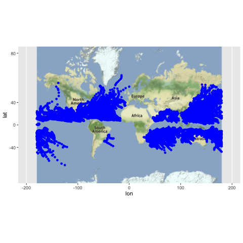
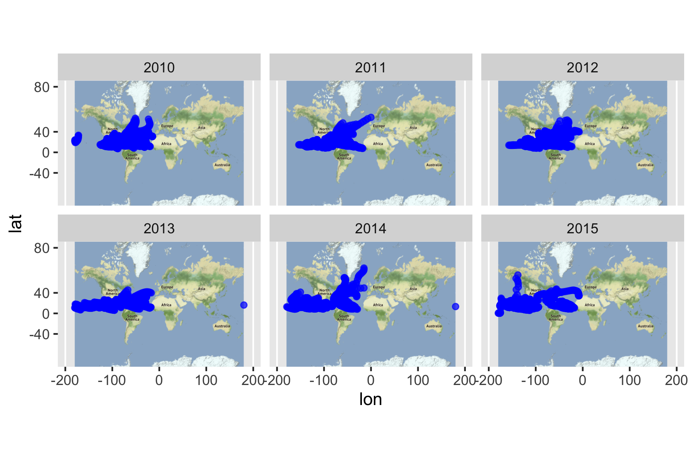
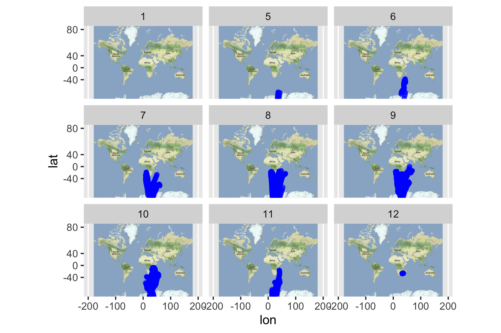

To begin with we need to do some preparation to import the dataset.
```{r}
library(dplyr)
library(readr)
library(ggplot2)
library(lubridate)
library(naniar)
```

```{r}
# read data file
ibt <- read_csv("/Users/zhangkehui/Desktop/UCB/Stat133/workouts/workout1/data/ibtracs-2010-2015.csv",col_names=c("serial_num","season","num","basin","sub_basin","name","iso_time", "nature", "latitude","longitude","wind","press"),col_types = "cicfccccdddd", skip = 1, na = c("-999.", "-1.0","0.0"))
ibt <- ibt %>% replace_with_na(replace = list( latitude = -999.00))
ibt <- ibt %>% replace_with_na(replace = list( longitude = -999.00))
ibt <- ibt %>% replace_with_na(replace = list( wind = -999))
ibt <- ibt %>% replace_with_na(replace = list( wind = -1))
ibt <- ibt %>% replace_with_na(replace = list( wind = 0))
ibt <- ibt %>% replace_with_na(replace = list( press = -999 ))
ibt <- ibt %>% replace_with_na(replace = list( press = -1 ))

```

In this report we want to look at this dataset, ibtracs-2010-2015.csv, from different respectives.  Firstly we would like to know the parameters--column names.     
```{r}
names(ibt)
```
Then we can get some interesting facts according to these parameters.  
There are 578 distinct storms during 2009 - 2016 in total.  And the details are:  88 in 2010, 96 in 2011, 91 in 2012, 103 in 2013, 94 in 2014, 105 in 2015.
```{r}
length(unique(ibt$serial_num))
```

```{r}
#ibt_year <- mutate(ibt, year = year(ibt$iso_time))
#storm_by_year <- group_by(ibt_year, year)
storm_by_year <- group_by(ibt, season)

summarise(storm_by_year, count = n_distinct(serial_num)  )
storm_by_year_count <- mutate(storm_by_year, count = n_distinct(serial_num))
```
We can also count the total number of the storms that happened to the different hemisphere. By running the following code we can get there are 7292 storms in the lower hemisphere and 12703 in the upper hemisphere.
And we can notice that 299 unique storms happened in the lower hemisphere and 400 in the upper hemisphere.
Therefore given these frequencies that the storms happened in the upper hemisphere and lower hemisphere we can conclude that storms tend to occur in the upper hemisphere than the other side.
```{r}
ibt_hemisphere <- mutate(ibt, hemisphere = (ibt$latitude >0))
storm_by_hemisphere  <- group_by(ibt_hemisphere , hemisphere )
tally(storm_by_hemisphere)
storm_by_year_uphemi <- filter(storm_by_hemisphere, hemisphere == "TRUE")
 summarise(storm_by_year_uphemi, count = n_distinct(serial_num))
 storm_by_year_lohemi <- filter(storm_by_hemisphere, hemisphere == "FALSE")
 summarise(storm_by_year_lohemi, count = n_distinct(serial_num))
```
To get more information we can even look at the month that storms prefer to occur.  After sunning the code below, we can see that the months that storms tend to occur are August, September and also October.  There are 2879, 2871, 2580 storms in total and 100, 109, 91 distinct storms.  
```{r}
ibt_month <- mutate(ibt, month = month(ibt$iso_time))
storm_by_month <- group_by(ibt_month, month)
tally(storm_by_month)
summarise(storm_by_month, count = n_distinct(serial_num)  )
```
Similarly we can research the relationship between basin and the frequencies of storms.  Then we can see that the basin WP was probably the most dangerous basin as for the frequencies of storms.  There are 173 distinct storms and 5958 in total in this basin.  And the second place was the basin EP where 134 distinct storms and 3493 storms in total occured.  
```{r}
ibt_basin <- select(ibt, serial_num, basin)
storm_by_basin <- group_by(ibt_basin, basin)
tally(storm_by_basin)
summarise(storm_by_basin, count = n_distinct(serial_num)  )
```
Instead of these details, we can also observe some graphsrelated to this dataset directly and conclude some general things from these graphs .
For example we can see the trajectories of all the storms during year 2010-2015. 


```{r echo=FALSE, fig.align = 'center'}

```
Also we can divide them into different groups by year and see the trajectories.

```{r echo=FALSE, fig.align = 'center'}

```
Or we can observe them with different months.
```{r echo=FALSE, fig.align = 'center'}

```


