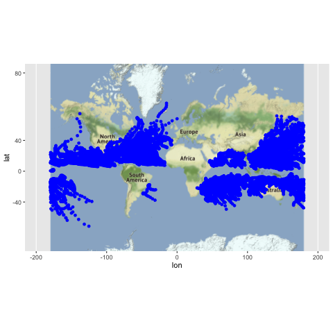
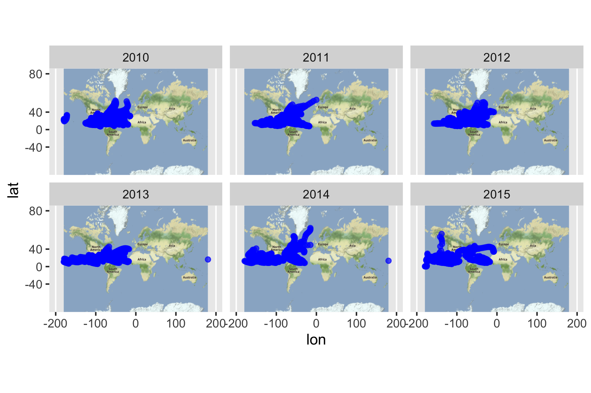

workout1-Kehui-Zhang
================

To begin with we need to do some preparation to import the dataset.

``` r
library(dplyr)
```

    ## 
    ## Attaching package: 'dplyr'

    ## The following objects are masked from 'package:stats':
    ## 
    ##     filter, lag

    ## The following objects are masked from 'package:base':
    ## 
    ##     intersect, setdiff, setequal, union

``` r
library(readr)
library(ggplot2)
library(lubridate)
```

    ## 
    ## Attaching package: 'lubridate'

    ## The following object is masked from 'package:base':
    ## 
    ##     date

``` r
library(naniar)
```

``` r
# read data file
ibt <- read_csv("/Users/zhangkehui/Desktop/UCB/Stat133/workouts/workout1/data/ibtracs-2010-2015.csv",col_names=c("serial_num","season","num","basin","sub_basin","name","iso_time", "nature", "latitude","longitude","wind","press"),col_types = "cicfccccdddd", skip = 1, na = c("-999.", "-1.0","0.0"))
ibt <- ibt %>% replace_with_na(replace = list( latitude = -999.00))
ibt <- ibt %>% replace_with_na(replace = list( longitude = -999.00))
ibt <- ibt %>% replace_with_na(replace = list( wind = -999))
ibt <- ibt %>% replace_with_na(replace = list( wind = -1))
ibt <- ibt %>% replace_with_na(replace = list( wind = 0))
ibt <- ibt %>% replace_with_na(replace = list( press = -999 ))
ibt <- ibt %>% replace_with_na(replace = list( press = -1 ))
```

In this report we want to look at this dataset, ibtracs-2010-2015.csv,
from different respectives. Firstly we would like to know the
parameters–column
    names.

``` r
names(ibt)
```

    ##  [1] "serial_num" "season"     "num"        "basin"      "sub_basin" 
    ##  [6] "name"       "iso_time"   "nature"     "latitude"   "longitude" 
    ## [11] "wind"       "press"

Then we can get some interesting facts according to these parameters.  
There are 578 distinct storms during 2009 - 2016 in total. And the
details are: 88 in 2010, 96 in 2011, 91 in 2012, 103 in 2013, 94 in
2014, 105 in 2015.

``` r
length(unique(ibt$serial_num))
```

    ## [1] 578

``` r
#ibt_year <- mutate(ibt, year = year(ibt$iso_time))
#storm_by_year <- group_by(ibt_year, year)
storm_by_year <- group_by(ibt, season)

summarise(storm_by_year, count = n_distinct(serial_num)  )
```

    ## # A tibble: 6 x 2
    ##   season count
    ##    <int> <int>
    ## 1   2010    88
    ## 2   2011    96
    ## 3   2012    91
    ## 4   2013   103
    ## 5   2014    94
    ## 6   2015   106

``` r
storm_by_year_count <- mutate(storm_by_year, count = n_distinct(serial_num))
```

We can also count the total number of the storms that happened to the
different hemisphere. By running the following code we can get there are
7292 storms in the lower hemisphere and 12703 in the upper hemisphere.
And we can notice that 299 unique storms happened in the lower
hemisphere and 400 in the upper hemisphere. Therefore given these
frequencies that the storms happened in the upper hemisphere and lower
hemisphere we can conclude that storms tend to occur in the upper
hemisphere than the other side.

``` r
ibt_hemisphere <- mutate(ibt, hemisphere = (ibt$latitude >0))
storm_by_hemisphere  <- group_by(ibt_hemisphere , hemisphere )
tally(storm_by_hemisphere)
```

    ## # A tibble: 3 x 2
    ##   hemisphere     n
    ##   <lgl>      <int>
    ## 1 FALSE       5572
    ## 2 TRUE       12703
    ## 3 NA          1720

``` r
storm_by_year_uphemi <- filter(storm_by_hemisphere, hemisphere == "TRUE")
 summarise(storm_by_year_uphemi, count = n_distinct(serial_num))
```

    ## # A tibble: 1 x 2
    ##   hemisphere count
    ##   <lgl>      <int>
    ## 1 TRUE         400

``` r
 storm_by_year_lohemi <- filter(storm_by_hemisphere, hemisphere == "FALSE")
 summarise(storm_by_year_lohemi, count = n_distinct(serial_num))
```

    ## # A tibble: 1 x 2
    ##   hemisphere count
    ##   <lgl>      <int>
    ## 1 FALSE        142

To get more information we can even look at the month that storms prefer
to occur. After sunning the code below, we can see that the months that
storms tend to occur are August, September and also October. There are
2879, 2871, 2580 storms in total and 100, 109, 91 distinct storms.

``` r
ibt_month <- mutate(ibt, month = month(ibt$iso_time))
storm_by_month <- group_by(ibt_month, month)
tally(storm_by_month)
```

    ## # A tibble: 12 x 2
    ##    month     n
    ##    <dbl> <int>
    ##  1     1  1653
    ##  2     2  1530
    ##  3     3  1374
    ##  4     4   751
    ##  5     5   743
    ##  6     6  1239
    ##  7     7  1807
    ##  8     8  2879
    ##  9     9  2871
    ## 10    10  2580
    ## 11    11  1217
    ## 12    12  1351

``` r
summarise(storm_by_month, count = n_distinct(serial_num)  )
```

    ## # A tibble: 12 x 2
    ##    month count
    ##    <dbl> <int>
    ##  1     1    57
    ##  2     2    48
    ##  3     3    38
    ##  4     4    26
    ##  5     5    30
    ##  6     6    53
    ##  7     7    70
    ##  8     8   100
    ##  9     9   109
    ## 10    10    91
    ## 11    11    46
    ## 12    12    45

Similarly we can research the relationship between basin and the
frequencies of storms. Then we can see that the basin WP was probably
the most dangerous basin as for the frequencies of storms. There are 173
distinct storms and 5958 in total in this basin. And the second place
was the basin EP where 134 distinct storms and 3493 storms in total
occured.

``` r
ibt_basin <- select(ibt, serial_num, basin)
storm_by_basin <- group_by(ibt_basin, basin)
tally(storm_by_basin)
```

    ## # A tibble: 7 x 2
    ##   basin     n
    ##   <fct> <int>
    ## 1 SI     4132
    ## 2 SP     2040
    ## 3 WP     5958
    ## 4 SA       49
    ## 5 NI     1465
    ## 6 EP     3493
    ## 7 NA     2858

``` r
summarise(storm_by_basin, count = n_distinct(serial_num)  )
```

    ## # A tibble: 7 x 2
    ##   basin count
    ##   <fct> <int>
    ## 1 SI      101
    ## 2 SP       58
    ## 3 WP      173
    ## 4 SA        2
    ## 5 NI       54
    ## 6 EP      134
    ## 7 NA       97

Instead of these details, we can also observe some graphsrelated to this
dataset directly and conclude some general things from these graphs .
For example we can see the trajectories of all the storms during year
2010-2015.


Also we can divide them into different groups by year and see the
trajectories.


Or we can observe them with different months.

